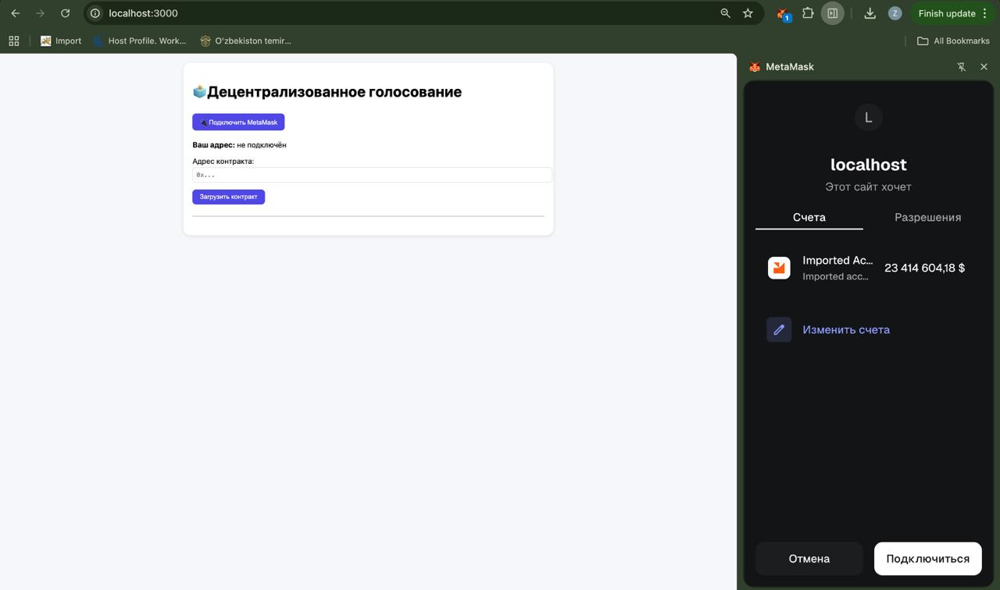
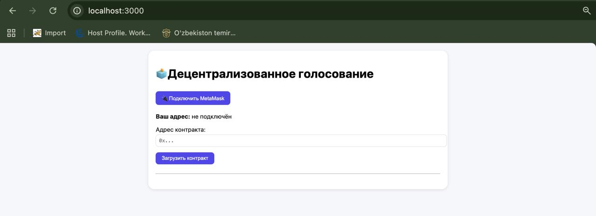
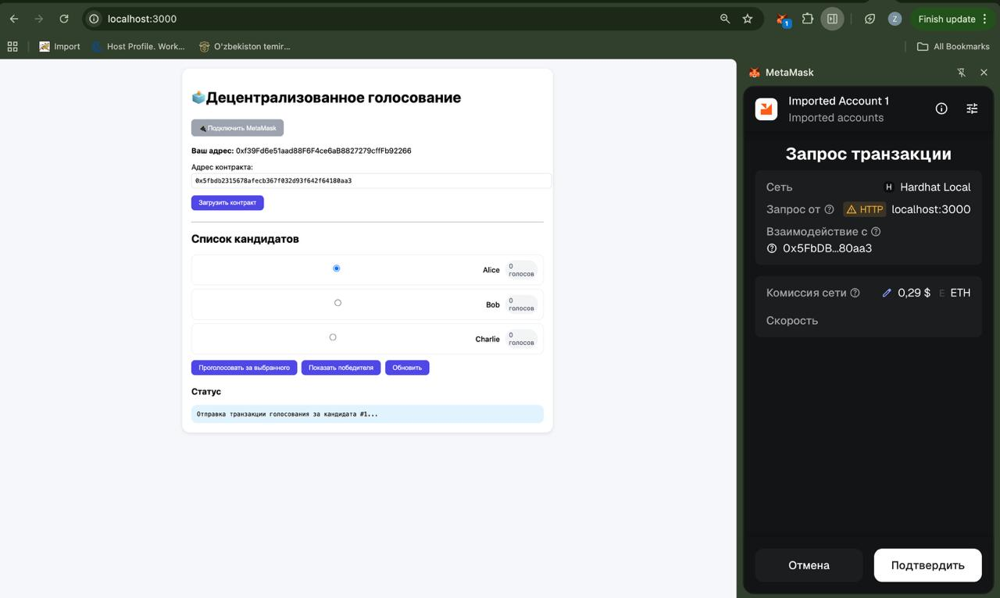
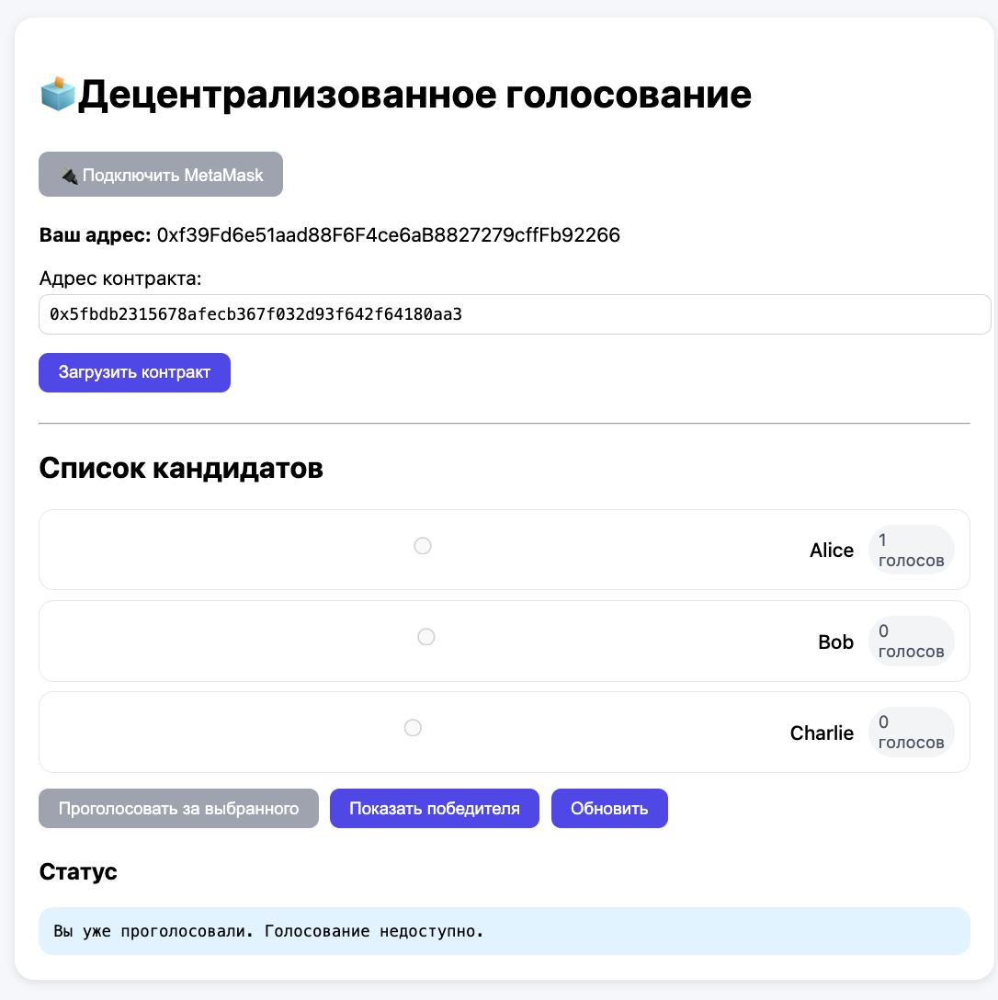
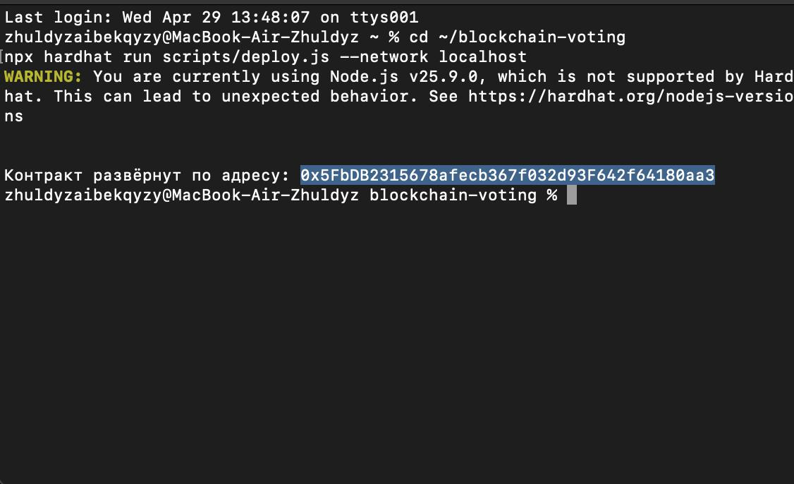

# 🧩 Blockchain Voting DApp

Децентрализованное приложение для голосования на базе Ethereum.  
Пользователи голосуют через MetaMask, а результаты сохраняются в блокчейне и не могут быть изменены.

---

## ⚙️ Технологии

* **Solidity** – смарт-контракт  
* **Hardhat** –  разработка и деплой
* **Ethers.js** – работа с блокчейном
* **MetaMask** – подключение кошелька
* **HTML/CSS/JS** – фронтенд (один файл)

---

## 📂 Структура проекта

```bash
blockchain-voting/
├── contracts/
│   └── Voting.sol        # Смарт - контракт
├── scripts/
│   └── deploy.js         # Скрипт деплоя
├── index.html            # Фронтенд (HTML+CSS+JS)
├── hardhat.config.js     # Конфигурация Hardhat
├── package.json
└── README.md
```

---

## 🧠 Смарт - контракт (`Voting.sol`)
Смарт-контракт отвечает за:
* хранение кандидатов
* подсчёт голосов
* защиту от повторного голосования
* определение победителя

<details>
<summary>Нажмите чтобы увидеть полный код смарт - контракта </summary>
```solidity
// SPDX-License-Identifier: MIT
pragma solidity ^0.8.0;

contract Voting {
    struct Candidate {
        uint id;
        string name;
        uint voteCount;
    }

    mapping(uint => Candidate) public candidates;
    mapping(address => bool) public hasVoted;
    uint public candidatesCount;
    address public owner;

    event Voted(address indexed voter, uint indexed candidateId);

    constructor(string[] memory _candidateNames) {
        owner = msg.sender;
        for (uint i = 0; i < _candidateNames.length; i++) {
            candidatesCount++;
            candidates[candidatesCount] = Candidate(candidatesCount, _candidateNames[i], 0);
        }
    }

    function vote(uint _candidateId) external {
        require(_candidateId > 0 && _candidateId <= candidatesCount, "Invalid candidate");
        require(!hasVoted[msg.sender], "Already voted");
        hasVoted[msg.sender] = true;
        candidates[_candidateId].voteCount++;
        emit Voted(msg.sender, _candidateId);
    }

    function getAllCandidates() external view returns (Candidate[] memory) {
        Candidate[] memory items = new Candidate[](candidatesCount);
        for (uint i = 1; i <= candidatesCount; i++) {
            items[i-1] = candidates[i];
        }
        return items;
    }

    function getWinner() external view returns (string memory winnerName, uint winnerVotes) {
        uint highestVotes = 0;
        uint winnerId = 0;
        for (uint i = 1; i <= candidatesCount; i++) {
            if (candidates[i].voteCount > highestVotes) {
                highestVotes = candidates[i].voteCount;
                winnerId = i;
            }
        }
        winnerName = candidates[winnerId].name;
        winnerVotes = highestVotes;
    }
}
</details>
```

---

## 🚀 Скрипт деплоя (`scripts/deploy.js`)

```javascript
const hre = require("hardhat");

async function main() {
  const candidateNames = ["Alice", "Bob", "Charlie"];
  const Voting = await hre.ethers.getContractFactory("Voting");
  const voting = await Voting.deploy(candidateNames);
  await voting.deployed();
  console.log("Contract deployed to:", voting.address);
}

main().catch(console.error);
```

---

## ⚙️ Конфигурация Hardhat  (`hardhat.config.js`)

```javascript
require("@nomiclabs/hardhat-ethers");

module.exports = {
  solidity: "0.8.19",
  networks: {
    hardhat: {},
    sepolia: {
      url: "https://rpc.sepolia.org",
      accounts: process.env.PRIVATE_KEY ? [process.env.PRIVATE_KEY] : []
    }
  }
};
```

---

## 🖥️ Фронтенд (`index.html`)


Фронтенд включает:
* Подключение MetaMask
* Список кандидатов
* Голосование
* Отображение победителя

<details>
<summary>Нажмите чтобы увидеть полный код фронтенда</summary>

```html
<!DOCTYPE html>
<html lang="ru">
<head>
    <meta charset="UTF-8">
    <title>Blockchain Voting</title>
    <style>
        body { font-family: system-ui; max-width: 800px; margin: auto; padding: 20px; background: #f5f7fa; }
        .card { background: white; border-radius: 16px; padding: 20px; margin-bottom: 20px; box-shadow: 0 2px 8px rgba(0,0,0,0.1); }
        button { background: #4f46e5; color: white; border: none; padding: 8px 16px; border-radius: 8px; cursor: pointer; margin-right: 8px; }
        .candidate { border: 1px solid #e5e7eb; border-radius: 12px; padding: 12px; margin: 8px 0; display: flex; align-items: center; gap: 12px; }
        .vote-count { background: #f3f4f6; padding: 4px 8px; border-radius: 20px; }
        #status { background: #e0f2fe; padding: 12px; border-radius: 12px; }
        input { width: 100%; padding: 8px; margin-top: 8px; }
    </style>
</head>
<body>
<div class="card">
    <h1>🗳️ Decentralized Voting</h1>
    <button id="connectBtn">Connect MetaMask</button>
    <p><strong>Your address:</strong> <span id="account">not connected</span></p>
    <label>Contract address:</label>
    <input type="text" id="contractAddrInput" placeholder="0x...">
    <button id="loadContractBtn">Load contract</button>
    <hr>
    <div id="contractInfo" style="display: none;">
        <h2>Candidates</h2>
        <div id="candidatesList"></div>
        <button id="voteBtn" disabled>Vote</button>
        <button id="winnerBtn">Show winner</button>
        <button id="refreshBtn">Refresh</button>
        <h3>Status</h3>
        <div id="status"></div>
    </div>
</div>
<script src="https://cdn.jsdelivr.net/npm/ethers@5.7.2/dist/ethers.umd.min.js"></script>
<script>
    let provider, signer, contract, selectedId = null;
    const contractABI = [
        "function getAllCandidates() view returns (tuple(uint256 id, string name, uint256 voteCount)[])",
        "function vote(uint256 candidateId)",
        "function getWinner() view returns (string,uint256)",
        "function hasVoted(address) view returns (bool)"
    ];

    document.getElementById('connectBtn').onclick = async () => {
        if (!window.ethereum) return alert("Install MetaMask");
        await ethereum.request({ method: 'eth_requestAccounts' });
        provider = new ethers.providers.Web3Provider(window.ethereum);
        signer = provider.getSigner();
        document.getElementById('account').innerText = await signer.getAddress();
        document.getElementById('connectBtn').disabled = true;
    };
</script>
</body>
</html>
```

</details>

---

## 🚀 Как запустить (локально)

### Prerequisites

* Node.js (v16+)
* MetaMask browser extension

### Шаги

```bash
git clone <repo-url>
cd blockchain-voting
npm install
```

```bash
npx hardhat node
```

```bash
npx hardhat run scripts/deploy.js --network localhost
```

```bash
npx http-server . -p 3000
```

Open http://localhost:3000

---

## 🌐 Деплой в Sepolia

```bash
PRIVATE_KEY=your_wallet_private_key
```

```bash
npx hardhat run scripts/deploy.js --network sepolia
```

---
## 📍 Адрес развернутого контракта (Sepolia Testnet)
Адрес смарт - контракта:
0x5FbDB2315678afecb367f032d93F642f64180aa3

## 📸 Скриншоты интерфейса

### 🔌 Подключение MetaMask

)
*Нажатие кнопки «Connect MetaMask» и выбор аккаунта.*

### 📋 Интерфейс приложения после загрузки контракта

*Отображение списка кандидатов (Alice, Bob, Charlie) с текущим количеством голосов.*

### 🗳️ Выбор кандидата и кнопка голосования и Подтверждение транзакции в MetaMask

*Выбран кандидат «Alice», кнопка «Vote» активна.*
*Всплывающее окно MetaMask с запросом подписи транзакции.*

### 🔐 Попытка проголосовать повторно – ошибка

*Сообщение об ошибке «Already voted» – защита от двойного голосования.*


### ⚙️ Вывод терминала после деплоя

*Терминал с выводом «Contract deployed to: 0x...» после успешного деплоя.*

### ⚙️ Вывод терминала после деплоя
*Могли бы мне кажется.*
## ✅ Возможности

* Один пользователь — один голос
* Подсчёт голосов в реальном времени
* Определение победителя
* Прозрачность через события

---

## 🔮 Будущие возможности

* Анонимное голосование (ZK)
* Ограничение по времени
* DAO-голосование
* Безгазовые транзакции

---

## 📄 License

MIT

---

## 👩‍💻 Авторы

* Қабиболла Жұлдыз
* Каримжанова Жанель  
* Кангерев Тимур Timur
* Жаркинбеков Дастан


